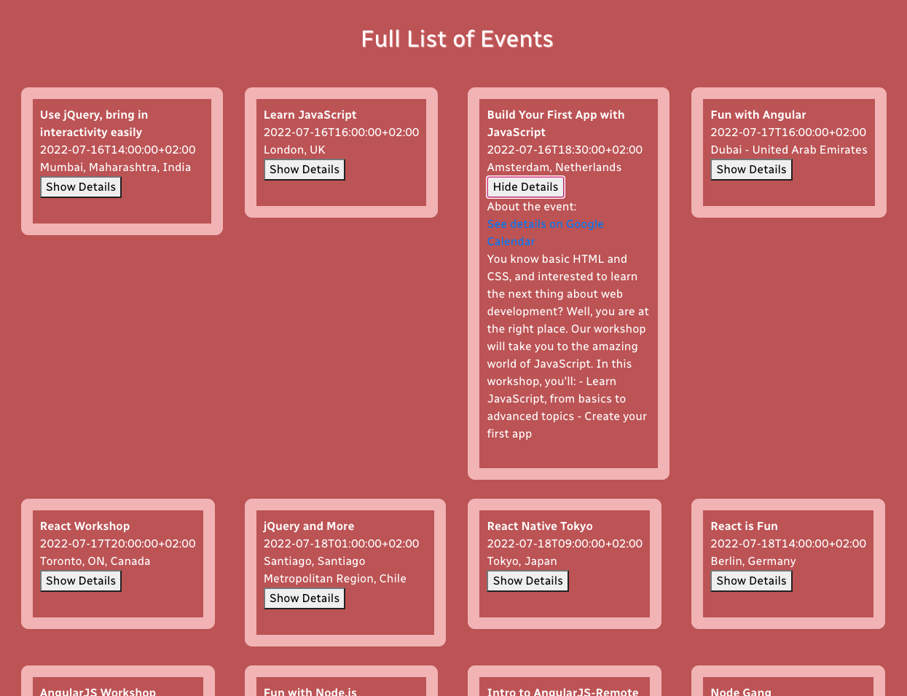

# Meet App

## Project Description
A server-less PWA app built using a TDD approach for Achievement 4 of my CareerFoundry course.

## Key Features
* User can see a list of all Career Foundry Web Dev events
* User can filter the events by city
* User can show or hide an event's details
* User can specify how many events they want to see
* User can use the app when offline
* User can see charts displaying how the number of events

## Technologies Used
* React
* Create-React-App
* Google OAuth2
* AWS Lambda
* Serverless Toolkit

## Links
* **Repository:** https://github.com/mareeanamaro/meet
* **Live link:** https://mareeanamaro.github.io/meet/

## Screenshots

## How to Use

* Clone or download repository ...
* `git clone https://github.com/mareeanamaro/meet.git`

* Connect to your github pages

* Follow the instructions provided by github: https://pages.github.com
* Edit homepage address in package.json to fit to your github account

* To run app on localhost:
* `npm run start`

* To push changes to github pages:
* `npm run deploy`